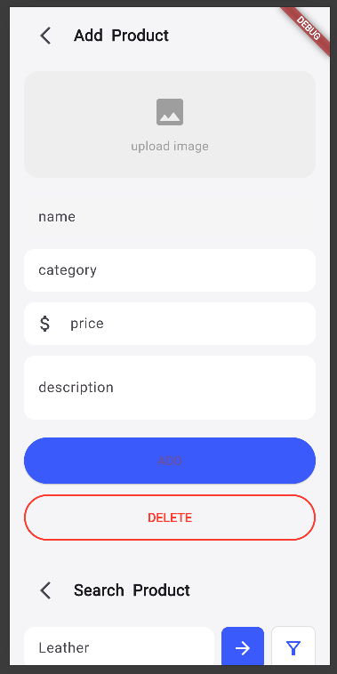

# 📱 Flutter UI Showcase

A simple Flutter application showcasing key UI screens including Home, Search, Detail, and Add/Delete functionality.

---

## 🏠 Home Page

The Home Page displays a list or grid of items that users can browse.


---

## 🔍 Search Page

A responsive Search Page with a search bar to filter through items dynamically.


---

## 📄 Detail Page

The Detail Page shows full information about a selected item.


---

## ➕➖ Add & Delete Page

This page allows the user to add new items or delete existing ones from the list.



---

## 🛠️ Tech Stack

- **Flutter** 3.32.6
- **Dart** (latest)
- Supports Android, Web, and optionally Windows

---

## 🚀 How to Run

1. Clone the repo
2. Navigate to the project directory
3. Run:
   ```bash
   flutter pub get
   flutter run
